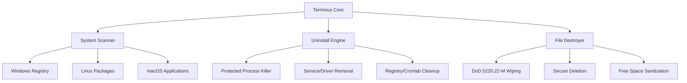

# 🔥 Terminus: The Ultimate System Cleaner 🔥

```
╔═══════════════════════════┤ Version v4.0 ├═════════════════════════════╗
║                                                                        ║
║  ████████╗███████╗██████╗ ███╗   ███╗██╗███╗   ██╗██╗   ██╗███████╗    ║
║  ╚══██╔══╝██╔════╝██╔══██╗████╗ ████║██║████╗  ██║██║   ██║██╔════╝    ║
║     ██║   █████╗  ██████╔╝██╔████╔██║██║██╔██╗ ██║██║   ██║███████╗    ║
║     ██║   ██╔══╝  ██╔══██╗██║╚██╔╝██║██║██║╚██╗██║██║   ██║╚════██║    ║
║     ██║   ███████╗██║  ██║██║ ╚═╝ ██║██║██║ ╚████║╚██████╔╝███████║    ║
║     ╚═╝   ╚══════╝╚═╝  ╚═╝╚═╝     ╚═╝╚═╝╚═╝  ╚═══╝ ╚═════╝ ╚══════╝    ║
║                       Ultimate System Cleaner                          ║
╚════════════════════════════════════════════════════════════════════════╝


=== Main Menu ===

1. Scan System Software
2. Remove Software
3. File Destroyer
4. Settings
5. View Logs
6. Exit

⚠️  Use with caution! Always backup important data.

Select option: _
```


**Terminus** isn't just another uninstaller - it's the digital equivalent of a **surgical strike** against stubborn software and sensitive files. When regular removal tools fail, Terminus succeeds with military-grade precision.

[](https://www.gnu.org/licenses/gpl-3.0)
[](https://github.com/sarat1kyan/Terminus)
[](https://github.com/sarat1kyan/Terminus)
[](https://github.com/sarat1kyan/Terminus)
[](https://github.com/sarat1kyan/Terminus)
[](https://www.python.org/downloads/)
[](https://www.python.org/downloads/)


## 🌟 Features That Pack a Punch

| Capability | Description | Emoji |
|------------|-------------|-------|
| **Nuclear Uninstallation** | Remove ANY software, no matter how deeply entrenched | 💣 |
| **Forensic File Destruction** | Wipe files beyond recovery (DoD 5220.22-M standard) | 🔥 |
| **Resistance Breaker** | Bypasses anti-uninstall protections and process locks | 🛡️ |
| **System-Wide Scanning** | Comprehensive detection of installed applications | 🔍 |
| **Stunning Terminal UI** | Beautiful, responsive interface with real-time monitoring | 🎨 |
| **Cross-Platform** | Works on Windows, Linux, and macOS | 🌐 |

## 🚀 Getting Started

### Prerequisites
```bash
# For Windows warriors
pip install pywin32 psutil colorama

# For Linux/macOS commandos
pip install psutil blessings
```

### Installation
```bash
git clone https://github.com/sarat1kyan/terminus.git
cd terminus
install.py
python terminus.py
```

## 🖥️ Platform-Specific Setup

<details>
<summary><b>Windows Configuration</b></summary>

### Requirements
- Windows 10/11 or Windows Server 2016+
- Python 3.10+ (from python.org or Microsoft Store)
- PowerShell 5.0+

```powershell
# Install dependencies
pip install psutil colorama pywin32 windows-curses

# Run as Administrator
python terminus.py --admin
```

### Windows-Specific Features
- Registry cleaning (HKLM/HKCU)
- System restore point creation
- Windows service removal
- Scheduled task elimination

</details>

<details>
<summary><b>Linux Configuration</b></summary>

### Requirements
- Linux kernel 3.10+
- sudo/root access for system operations

```bash
# Debian/Ubuntu
sudo apt update
sudo apt install python3-pip python3-dev
pip3 install psutil colorama

# Run with elevated privileges
sudo python3 terminus.py
```

### Supported Package Managers
- APT, YUM/DNF, Pacman, Zypper
- Snap/Flatpak (limited support)

</details>

<details>
<summary><b>macOS Configuration</b></summary>

### Requirements
- macOS 10.15 (Catalina) or newer
- Admin password for sudo operations

```bash
# Install via Homebrew
brew install python@3.11
pip3 install psutil colorama

# Run with privileges
sudo python3 terminus.py
```

### macOS Features
- .app bundle removal
- Homebrew integration
- Launch agent cleanup
- Preference file deletion

</details>


## 🛡️ Safety & Operations Guide

### ⚠️ Known Issues & Solutions

<details>
<summary><b>macOS Specific Issues</b></summary>

```bash
# "Operation not permitted" error:
1. Go to System Preferences → Security & Privacy → Privacy
2. Select Full Disk Access
3. Add your Terminal application to the allowed list

# Gatekeeper blocking execution:
xattr -d com.apple.quarantine terminus.py
```

</details>

### 🛡️ Universal Precautions

**Before launching any operation:**

#### 1. Create System Backups
```bash
# Linux/macOS (rsync):
sudo rsync -av --progress / /backup/location \
--exclude={/dev,/proc,/sys,/tmp,/run,/mnt,/media,/lost+found}

# Windows (wbadmin):
wbadmin start backup -backupTarget:E: -include:C: -allCritical -quiet
```

#### 2. Document Your System
```bash
# Windows software inventory:
wmic product get name,version > software_list.txt

# Debian/Ubuntu packages:
dpkg -l > software_list.txt

# macOS applications:
brew list --versions > brew_list.txt
ls /Applications > applications_list.txt
```

#### 3. Virtual Machine Testing
```diff
+ Mandatory for dangerous operations +
- Install VirtualBox/VMware
- Create snapshot before testing
- Practice removal operations safely
```

### ☠️ Critical Software Protection

| Platform       | Never Remove These Components              | Consequences               |
|----------------|-------------------------------------------|----------------------------|
| **Windows**    | Defender, .NET, DirectX, KB updates       | ⚠️ System instability     |
| **Linux**      | Kernel, libc, systemd, coreutils          | 💥 Unbootable system      |
| **macOS**      | System frameworks, kexts, security        | 🚫 Loss of core functions |

### 🆘 Emergency Recovery

<details>
<summary><b>Windows Recovery</b></summary>

```powershell
1. Boot from installation media
2. Select "Repair your computer"
3. Choose Troubleshoot → Advanced Options
4. Run: sfc /scannow
5. Use System Restore if available
```
</details>

<details>
<summary><b>Linux Recovery</b></summary>

```bash
1. Boot from Live USB
2. Mount root partition: mount /dev/sda1 /mnt
3. Chroot: chroot /mnt
4. Reinstall packages: apt install --reinstall coreutils systemd
5. Update bootloader: update-grub
```
</details>

<details>
<summary><b>macOS Recovery</b></summary>

```bash
1. Reboot holding Cmd+R
2. Open Disk Utility → Repair Disk
3. Reinstall macOS without losing data
4. Restore from Time Machine backup
```
</details>

### ⚡Optimization Tips:
```bash
# Linux/macOS - Lower priority:
nice -n 15 python3 terminus.py

# Windows - Reduce priority:
start /belownormal python terminus.py

# All systems - Disable animations:
python terminus.py --minimal-ui
```

#### Performance Characteristics:
| Operation          | Time Range      | CPU Usage | Disk I/O  |
|--------------------|----------------|-----------|-----------|
| System Scan        | 2-10 minutes   | Medium    | Low       |
| Standard Removal   | 1-5 minutes    | Medium    | Medium    |
| Secure File Wipe   | 5-15+ minutes  | High      | Very High |
| Registry Cleanup   | 1-10 minutes   | Low       | Medium    |

---


## 🕹️ Usage Demo

```
[+] Scanning system... 247 applications detected!

┌── Software Removal ───────────────────────────────────┐
│ 1. Adobe Creative Cloud (v5.8.0)                      │
│ 2. McAfee SecurityScan Plus (Resistant)               │
│ 3. Norton Utilities 22 (Running)                      │
│ 4. SomeMalware.exe (High Threat)                      │
└───────────────────────────────────────────────────────┘

❯ Enter selection (comma separated): 2,4

[!] McAfee SecurityScan Plus has anti-removal protection!
[+] Deploying countermeasures:
    ✔️ Terminated 3 protected processes
    ✔️ Bypassed registry locks
    ✔️ Removed hidden service

[☢] Preparing to destroy SomeMalware.exe:
    ✔️ 7-pass secure wipe initiated
    ✔️ File signature obliterated
    ✔️ Free space sanitized

[✔] Targets eliminated! Reclaimed 2.7GB space
```

## 🛠️ Technical Arsenal



## ⚠️ Important Warning

```diff
- THIS IS A POWERFUL WEAPON -
+ Use with extreme caution! +

Terminus performs irreversible operations. 
We are not responsible for:
• Destroyed systems 🖥️💥
• Vaporized important files 📂🔥
• Angry IT departments 👨💼👿

Always test in a VM first!
```

## ⚖️ Legal & Compliance
- **Corporate Environments**: Consult IT before use
- **Licensed Software**: Ensure compliance
- **Data Protection**: Follow local regulations
- **Audit Trails**: Maintain operation logs

## 📚 Support Resources
- [GitHub Issues](https://github.com/sarat1kyan/terminus/issues) - Bug reports
- [Project Wiki](https://github.com/sarat1kyan/terminus/wiki) - Full documentation
- [Community Forum](https://github.com/sarat1kyan/terminus/discussions) - Tips & tricks

## 🌈 Contribution

Join our elite development team:

1. Fork the Project
2. Create Feature Branch (`git checkout -b feature/DeathStarLaser`)
3. Commit Changes (`git commit -m 'Add planet-destroying capability'`)
4. Push Branch (`git push origin feature/DeathStarLaser`)
5. Open Pull Request

## 📜 License

Distributed under **DO WHAT THE HELL YOU WANT TO PUBLIC LICENSE**.  
See `LICENSE` for details.

---

<div align="center">

**⭐ If Terminus has helped to manage your system, please star the repository! ⭐**

[](https://github.com/sarat1kyan/Terminus/stargazers)
[](https://github.com/sarat1kyan/Terminus/network/members)
[](https://github.com/sarat1kyan/Terminus/watchers)

---

### 🔗 **Quick Links**

[📥 **Download**](https://github.com/sarat1kyan/Terminus/archive/refs/heads/main.zip) • [📖 **Documentation**](https://github.com/sarat1kyan/Terminus/wiki) • [🐛 **Report Bug**](https://github.com/sarat1kyan/Terminus/issues) • [💡 **Request Feature**](https://github.com/sarat1kyan/Terminus/issues) • [💬 **Discussions**](https://github.com/sarat1kyan/Terminus/discussions)

---

**Built with ❤️ by Mher Saratikyan | HEXESHELL**

*Licensed under GPL v3.0 | Copyright © 2025 Terminus Security Project*

</div>

```
When the going gets tough, the tough get Terminus.
```
